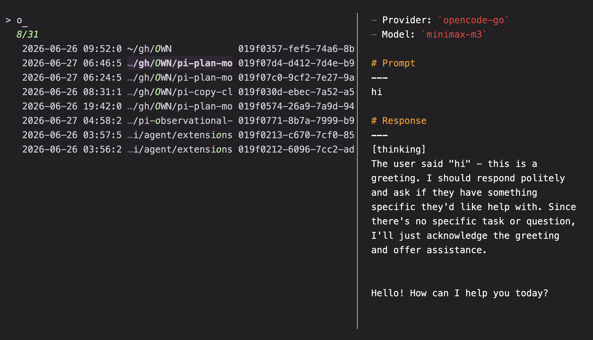
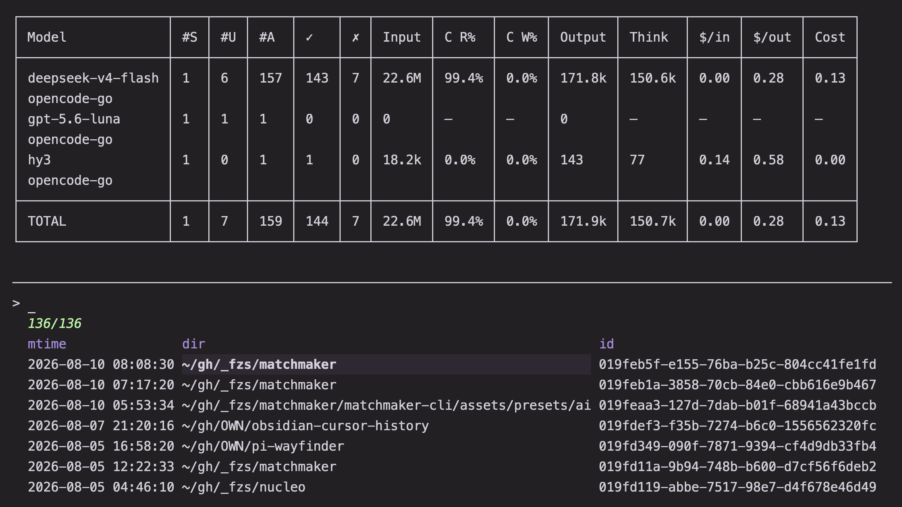
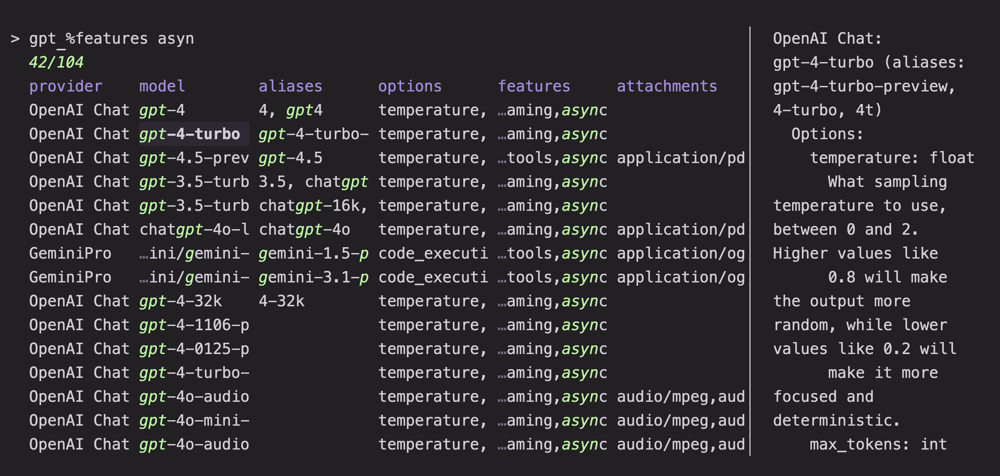
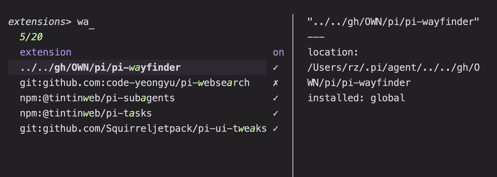

##### Session picker

Pi coding harness session picker

##### LLM Model picker

Model picker for [llm](https://llm.datasette.io/en/stable/)

##### Pi extension manager

This preset reads `~/.pi/agent/mm_extensions` (`$MM_EXTENSIONS_FILE`) for your desired extension setup.
The rows shown may not reflect your current pi settings! Trigger `@reconcile` (ctrl-r) to update the file to reflect your current extension settings for this project. You can also uncomment the `@start` bind to have this run on start.
Trigger `@accept` to toggle extensions.
Trigger `@set global` or `@set local` to apply the shown configuration local/global pi settings.
Trigger `@prune` to uninstall extensions found in the global/project git and npm install folders that are not in this list.

